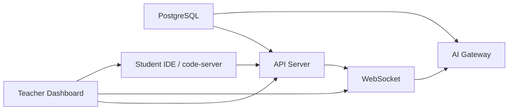

<picture>
  <source media="(prefers-color-scheme: dark)" srcset="https://img.shields.io/badge/status-beta-blue?style=flat-square">
  
</picture>

# SQLense

**数据库实验课，不再靠巡堂。**

SQLense 是一个面向高校数据库课程的智能教学平台。每位学生启动独立的 IDE 容器 + PostgreSQL 实例，教师通过实时监控面板掌握全班进度，AI 自动诊断 SQL 错误并标记优先级。

## 为什么用 SQLense？

- **学生隔离** — 每人独立数据库 + 独立 code-server，互不干扰
- **实时可见** — 教师面板实时展示每位学生的 SQL 执行、错误、空闲状态
- **AI 诊断** — 4 个 Agent 协同分析: 检测语法错误、约束缺失、表结构异常
- **即开即用** — `docker compose up` 一键启动，无需手动配置学生环境

## 快速体验

```bash
git clone https://github.com/your-org/sqlense.git
cd sqlense
docker compose up -d --build
```

打开 http://localhost:3000，使用 `admin` / `admin` 登录。

## 适用场景

| 场景 | 效果 |
|------|------|
| 50 人 SQL 实验课 | 教师无需逐台机器检查，面板一目了然 |
| 课后在线实验 | 学生通过浏览器访问 IDE，无需本地安装 |
| 混合式教学 | AI 自动批改 + 教师集中讲解错误模式 |

## 技术栈

| 层次 | 技术 |
|------|------|
| 前端 | React 19, TypeScript, Tailwind v4, shadcn/ui |
| 后端 | Express, Socket.IO, PostgreSQL |
| AI | Pydantic AI, DeepSeek API, 多 Agent 架构 |
| 容器 | Docker Compose, code-server, Nginx |
| 扩展 | VS Code Extension, SQLTools 集成 |

## 系统架构

7 个 Docker 容器协作。



## 文档

- [技术文档](doc/intro.md) — 架构说明、API 文档、测试报告
- [测试报告](doc/intro.md#测试) — Layer 1-3 全覆盖，30/30 通过

## 许可

MIT
