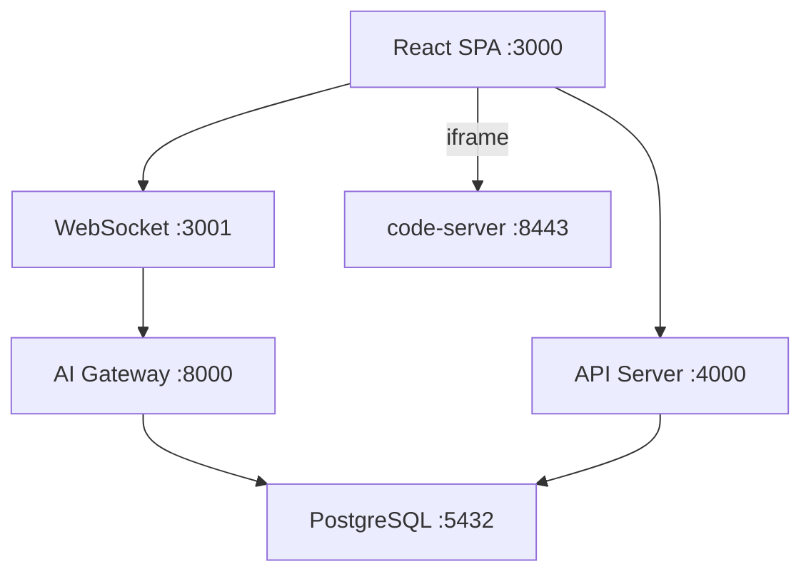

# SQLense

数据库实验课教学平台。学生身份认证 → 独立 IDE + 独立数据库 → 教师端实时监控 + AI 分析。

## 快速开始

```bash
docker compose up -d --build
```

| 入口 | 地址 | 说明 |
|------|------|------|
| 前端 | http://localhost:3000 | React SPA |
| API | http://localhost:4000/api/health | REST |
| Auth Proxy | http://localhost:8080 | code-server 认证代理 |
| Student IDE | http://localhost:8443 | 学生 code-server |

默认账号: `admin` / `admin`

## 架构



## 文档

| 文档 | 内容 |
|------|------|
| [SCRIPTS.md](doc/SCRIPTS.md) | 脚本、命令、默认账号 |
| [DATABASE.md](doc/DATABASE.md) | 数据库表结构、ER 图、外键 |
| [EXTENSION.md](doc/EXTENSION.md) | VS Code 插件架构、钩子、配置 |
| [WEBSOCKET.md](doc/WEBSOCKET.md) | WebSocket 事件、时序、断线保护 |
| [DEPLOYMENT.md](doc/DEPLOYMENT.md) | 生产部署、扩缩容、运维 |
