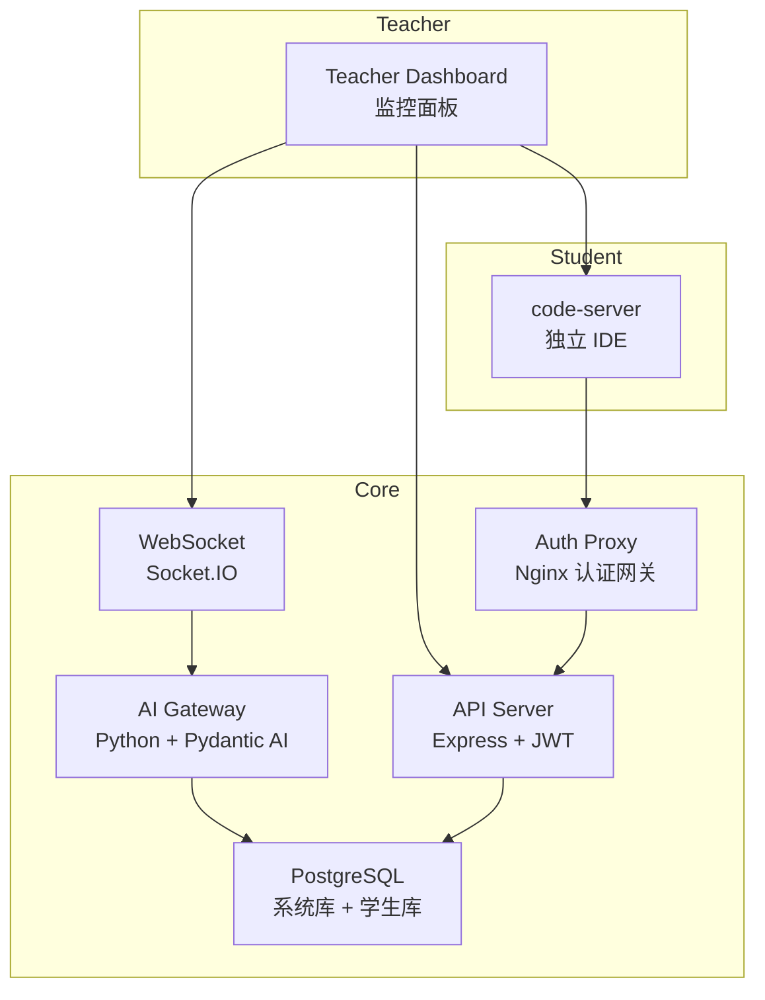

<div align="center">

# SQLense

**智能编程实验室教学平台 —— 学生独立环境 + 实时监控 + AI 自动诊断**

</div>

<div align="center">


</div>

<div align="center" style="margin-top: 8px;">

[在线体验](https://demo.sqlense.io) · [技术文档](doc/intro.md) · [定制其他语言](#-multi-language-lab)

</div>

---

## 什么场景需要 SQLense？

| 场景 | 现状 | SQLense |
|------|------|---------|
| 50 人 SQL 实验课 | 教师挨个巡堂、学生装环境半小时 | 一键部署，面板俯瞰全班 |
| 课后在线实验 | 学生本地装 PostgreSQL，版本/配置各异 | 浏览器打开即用，每人独立环境 |
| 混合式教学 | 作业手工批改，反馈滞后一周 | AI 实时诊断，错误模式自动分析 |
| 编程入门课 | 环境配置劝退，助教疲于 Debug | 标准化容器环境 + 远程协助 |

SQLense 不只是一个 SQL 教学工具 —— 它的架构可以扩展到 **C、C++、Java、Python** 等任何编程语言的教学场景。

---

## 功能一览

### 学生端

| 功能 | 说明 |
|------|------|
| 独立 IDE | 每人一个 code-server 容器（VS Code Web 版），无需本地安装 |
| 独立数据库 | 每人专属 PostgreSQL 实例，互不干扰 |
| SQL 智能提示 | 内置 SQL Tools 插件 + 语法实时诊断 |
| VS Code 扩展 | Telemetry 采集、远程控制、SQL 错误检测 |

### 教师端

| 功能 | 说明 |
|------|------|
| 实时监控面板 | 全班学生状态一览：在线/离线/空闲/SQL 执行 |
| AI 优先级排序 | 自动标记 critical / high / medium / low 学生 |
| 智能诊断 | 多 Agent 协同分析：代码 Agent + SQL Agent + Judge |
| 远程协助 | 一键接管学生 IDE 画面 |
| 进度追踪 | 每位学生的任务完成度、错误次数、活跃时长 |

### AI 分析引擎

```
Code Agent ── 检测 SQL 语法错误、模式问题
    │
SQL Agent ── 连接真实数据库、执行查询、验证表结构
    │
Judge ── 综合诊断、生成优先级、给出教学建议
    │
Batch Agent ── 批量过滤 100 条汇总数据，发现异常自动推送
```

---

## 快速开始

```bash
git clone https://github.com/prisflow/sqlense.git
cd sqlense
docker compose up -d --build
```

打开 http://localhost:3000，使用 `admin` / `admin` 登录。

| 服务 | 地址 | 说明 |
|------|------|------|
| 教师面板 | http://localhost:3000 | React SPA |
| API | http://localhost:4000/api/health | REST |
| Student IDE | http://localhost:8443 | code-server |
| Auth Proxy | http://localhost:8080 | 统一认证入口 |

---

## 架构

```
7 个容器，一条命令启动
```




---

## Multi-Language Lab

这套架构的核心模式 —— **独立容器 + 行为采集 + AI 诊断** —— 不限于 SQL。

```
    ┌──────────────┐     ┌────────────────┐     ┌──────────────┐
    │ SQL Lab      │     │ C / C++ Lab    │     │ Java Lab     │
    │ (现有)       │     │ (可定制)       │     │ (可定制)     │
    ├──────────────┤     ├────────────────┤     ├──────────────┤
    │ code-server  │     │ code-server    │     │ code-server  │
    │ PostgreSQL   │     │ GCC / GDB      │     │ JDK / Maven  │
    │ SQLTools     │     │ VS Code C++    │     │ VS Code Java │
    │ SQL Agent    │     │ C++ Agent      │     │ Java Agent   │
    └──────────────┘     └────────────────┘     └──────────────┘
```

只要更换 **容器镜像** + **AI Agent 的 Prompt**，就能为一个新语言搭全套教学平台。

**需要定制？** → [联系我们](mailto:your-email@example.com)

---

## 测试

三层测试覆盖 30 个学生、4 种场景（correct / missing_constraints / not_started / off_track）。

```
Layer 1 (全局 Batch): 30 分析  0 错误
Layer 2 (单生高频):   30 分析  0 错误
Layer 3 (全量直接):   30/30 通过  0 错误
总计: 90 分析  全部通过 ✅
```

---

## 文档

| 文档 | 说明 |
|------|------|
| [技术介绍](doc/intro.md) | 架构详解、API 文档、测试报告 |
| [部署指南](doc/DEPLOYMENT.md) | 生产环境部署、扩缩容 |
| [AI Gateway](doc/AI_GATEWAY.md) | 多 Agent 架构、数据模型、API |
| [WebSocket](doc/WEBSOCKET.md) | 事件协议、时序、断线保护 |
| [数据库设计](doc/DATABASE.md) | 表结构、ER 图、外键 |
| [VS Code 扩展](doc/EXTENSION.md) | 插件架构、钩子、配置 |

---

## 许可

[MIT](LICENSE)

---

<div align="center">

**SQLense** · [在线体验](https://demo.sqlense.io) · [提交 Issue](https://github.com/prisflow/sqlense/issues) · [定制需求](mailto:your-email@example.com)

</div>
