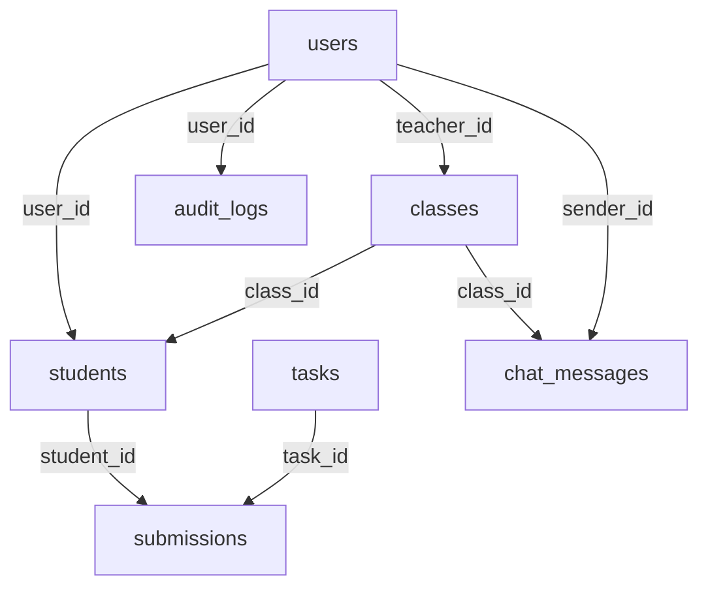

# 数据库结构

所有表位于 `system` schema 下，数据库名 `sqlense`。

```mermaid
erDiagram
    users {
        uuid id PK
        varchar username UK "登录账号"
        varchar password_hash "bcrypt hash"
        varchar role "admin | teacher | student"
        varchar display_name
        timestamp created_at
    }

    classes {
        uuid id PK
        varchar name
        uuid teacher_id FK "→ users.id"
        timestamp created_at
    }

    students {
        uuid id PK
        uuid user_id FK "→ users.id, UK"
        uuid class_id FK "→ classes.id"
        varchar student_no UK "学号"
        varchar pg_db_name "独立 PG 库名"
        varchar pg_role_name "独立 PG 角色名"
        int cs_port "code-server 端口"
        varchar cs_password
        varchar status "active | inactive | disabled"
        timestamp created_at
    }
 
     audit_logs {
        uuid id PK
        uuid user_id FK "→ users.id"
        varchar username
        varchar role
        varchar action "事件类型"
        jsonb detail
        varchar ip
        timestamp created_at
    }

    task_files {
        uuid id PK
        uuid class_id FK "→ classes.id"
        varchar task_group "任务分组名称"
        varchar filename
        varchar filepath
        int filesize
        varchar mime
        uuid uploaded_by FK "→ users.id"
        timestamp created_at
    }

    settings {
        varchar key PK
        text value
        timestamp updated_at
    }

    chat_messages {
        uuid id PK
        uuid class_id FK "→ classes.id"
        uuid sender_id FK "→ users.id"
        varchar display_name "发送者显示名"
        text content
        timestamp created_at
    }
```



## 外键关系



## 学生隔离

每个学生在 PG 中拥有独立的数据库和角色：

```
db_student_2024001  ← 数据库
role_student_2024001  ← 角色（有登录权限）
```

学生容器内的 psql 凭证在创建时固化，学生无法访问其他库。
