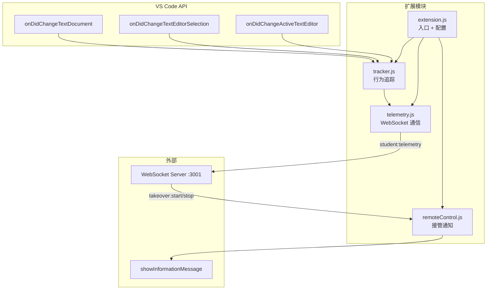

# VS Code 扩展 (SQLense Plugin)

学生 code-server 容器中预装的插件，负责行为追踪、WebSocket 通信、接管通知。

## 架构



## 激活方式

| 事件 | 说明 |
|------|------|
| `onLanguage:sql` | 打开 SQL 文件时 |
| `onCommand:sqlense.connect` | 执行连接命令时 |
| `onStartupFinished` | VS Code 启动完成后自动激活 |

## 采集策略

扩展只在三种情况下发送数据，每次发都带当前编辑器全文快照：

| 触发条件 | 事件类型 | 负载内容 |
|---------|---------|---------|
| IDE 红线（pgsql-ast-parser 语法错误）持续≥5秒且累计≥2次 | `error` | `source: "diagnostics"`, `code`, `codeHistory`, `errors[]` |
| SQL 执行报错（SQLTools 返回 ERROR / does not exist） | `error` | `source: "sqltools"`, `code`, `codeHistory`, `message` |
| 空闲超过 3 分钟 | `idle` | `duration` |

### 代码历史记录

- 每 30 秒轮询一次当前 SQL 文件内容
- 滚动保存最近 5 个快照
- 只在 error/diagnostics 触发时附带发送

### 空闲检测

```
用户活动 → 重置计时器
每 60 秒检查 → 如果距离最后活动 >180 秒 → 发送 idle 事件
```

## 配置

| 配置项 | 环境变量 | 默认值 |
|--------|---------|--------|
| `sqlense.wsServer` | `SQLENSE_WS_SERVER` | `ws://localhost:3001` |
| `sqlense.studentId` | `STUDENT_ID` | `unknown` |
| `sqlense.studentName` | `STUDENT_NAME` | `Unknown` |

## 接管通知

| 教师操作 | WebSocket 事件 | 学生端反应 |
|---------|--------------|----------|
| 点击"接管" | `takeover:start` | 弹警告"教师正在查看你的屏幕" |
| 点击"关闭" | `takeover:stop` | 弹信息"教师已停止查看你的屏幕" |
