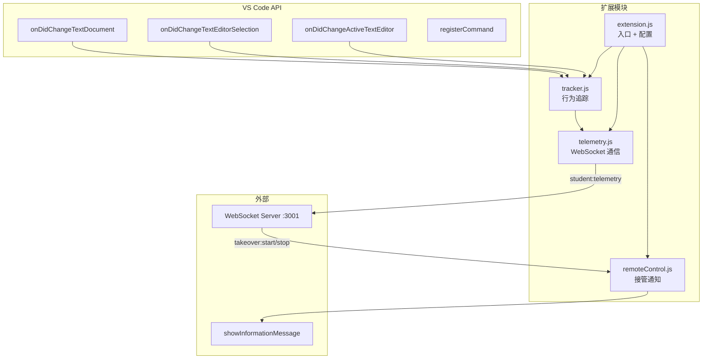

# VS Code 扩展 (SQLense Plugin)

学生 code-server 容器中预装的插件，负责行为追踪、WebSocket 通信、接管通知。

## 架构



## 激活方式

`activationEvents` 三种触发：

| 事件 | 说明 |
|------|------|
| `onLanguage:sql` | 打开 SQL 文件时 |
| `onCommand:sqlense.connect` | 执行连接命令时 |
| `onStartupFinished` | VS Code 启动完成后自动激活 |

## 追踪钩子 (tracker.js)

| VS Code API | 触发时机 | 发送事件类型 | 负载内容 |
|-------------|---------|-------------|---------|
| `workspace.onDidChangeTextDocument` | SQL 文件内容变更 | `editor` | `{ fileName, changeCount, lineCount }` |
| `window.onDidChangeActiveTextEditor` | 切换编辑器标签 | `editor` | `{ event: "focus", fileName, languageId }` |
| `window.onDidChangeTextEditorSelection` | 光标移动 | — | 仅重置空闲计时器，不发事件 |
| 空闲检测 (定时器) | 30 秒无操作 | `idle` | `{ duration }` |

空闲检测逻辑：

```js
// 每次用户活动时记录时间戳
// 每 30 秒检查一次，如果 idle > 30s 就发事件
setInterval(check, 30000)
```

## 配置

通过 VS Code 设置 `sqlense.*` 配置：

| 配置项 | 环境变量 | 默认值 |
|--------|---------|--------|
| `sqlense.wsServer` | `SQLENSE_WS_SERVER` | `ws://localhost:3001` |
| `sqlense.studentId` | `STUDENT_ID` | `unknown` |
| `sqlense.studentName` | `STUDENT_NAME` | `Unknown` |

设置写入 `/config/data/User/settings.json`：

```json
{
  "sqlense.wsServer": "ws://websocket:3001",
  "sqlense.studentId": "2024001",
  "sqlense.studentName": "张三"
}
```

## 接管通知

| 教师操作 | WebSocket 事件 | 学生端反应 |
|---------|--------------|----------|
| 点击"接管" | `takeover:start` | 弹警告"教师正在查看你的屏幕" |
| 点击"关闭" | `takeover:stop` | 弹信息"教师已停止查看你的屏幕" |

接管画面本身通过 iframe 嵌入学生 code-server（`http://localhost:<port>`），不走 WebSocket。
