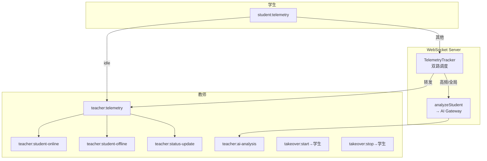
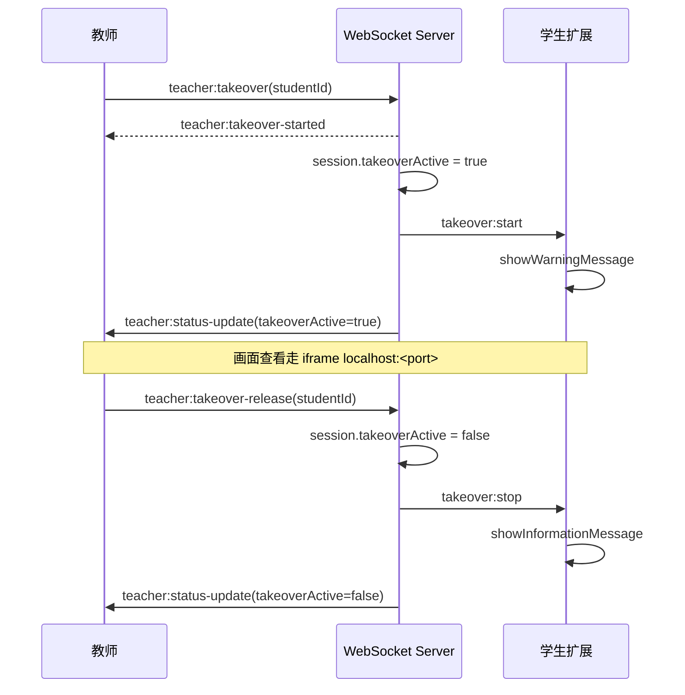

# WebSocket 事件

基于 Socket.IO，端口 3001。教师和学生通过 `query.role` 区分身份。

## 身份

```
教师:   io(url, { query: { role: "teacher", teacherId } })  # teacherId = 教师用户 UUID，用于班级过滤
学生:   io(url, { query: { role: "student", studentId, studentName } })
```

## 事件总览



## 学生 → 服务器

| 事件 | 触发 | 数据类型 |
|------|------|---------|
| `student:telemetry` | 终端报错/诊断/空闲 | `{ type: "error"|"terminal"|"idle", timestamp, payload }` |

## 服务器 → 教师

| 事件 | 触发 | 数据 |
|------|------|------|
| `teacher:student-list` | 教师连接后全量推送在线学生 | `Partial<StudentInfo>[]` |
| `teacher:student-online` | 学生 WebSocket 连接 | `{ studentId, studentName }` |
| `teacher:student-offline` | 学生断线后 5 秒 | `{ studentId }` |
| `teacher:telemetry` | 转发学生遥测 | `{ studentId, data }` |
| `teacher:status-update` | 接管状态变化 | `{ studentId, takeoverActive }` |
| `teacher:ai-analysis` | AI 分析完成（手动/自动） | `{ studentId, analysis }` |
| `teacher:error` | 操作失败 | `{ studentId?, message }` |
| `takeover:state` | 学生断开导致接管中断 | `{ type: "disconnected" }` |

## 教师 → 服务器

| 事件 | 说明 |
|------|------|
| `teacher:takeover` | 请求接管学生 `{ studentId }` |
| `teacher:takeover-release` | 释放接管 `{ studentId }` |
| `teacher:ai-query` | 手动触发 AI 分析 `{ studentId, taskGroup? }` |
| `chat:send` | 发送聊天消息 `{ classId, content }` |
| `chat:history` | 拉取聊天历史 `{ classId }` → callback `{ classId, messages[] }` |

## 学生 → 服务器

| 事件 | 说明 |
|------|------|
| `chat:send` | 发送聊天消息 `{ content }`（classId 由服务端从学生身份获取） |
| `chat:history` | 拉取聊天历史 → callback `{ classId, messages[] }` |

## 服务器 → 客户端（广播至班级 room）

| 事件 | 说明 |
|------|------|
| `chat:message` | 新消息广播 `{ id, classId, senderId, displayName, content, createdAt }` |
| `chat:error` | 发送失败 `{ message }` |

## TelemetryTracker 调度

```
record(studentId, data)
  ├─ studentFreq[studentId] 滑动窗口(10s)
  │   └─ ≥5 条 → flushStudent → POST /analyze → teacher:ai-analysis
  │       └─ 清空该生 buffer
  ├─ globalCount++
  │   └─ ≥100 → flushGlobal → POST /batch
  │       ├─ push → POST /analyze → teacher:ai-analysis
  │       └─ clear → 丢弃
  └─ 转发给教师: teacher:telemetry
```

idle 事件跳过 tracker，直接广播 `teacher:telemetry`。

## 断线缓冲

学生 WebSocket 断开后，服务器不立即标记离线，等待 5 秒：

```
学生断线 → 5 秒计时 → 未重连 → 标记 offline
                      ↓
                 重连成功 → 取消计时
```

## 接管时序


