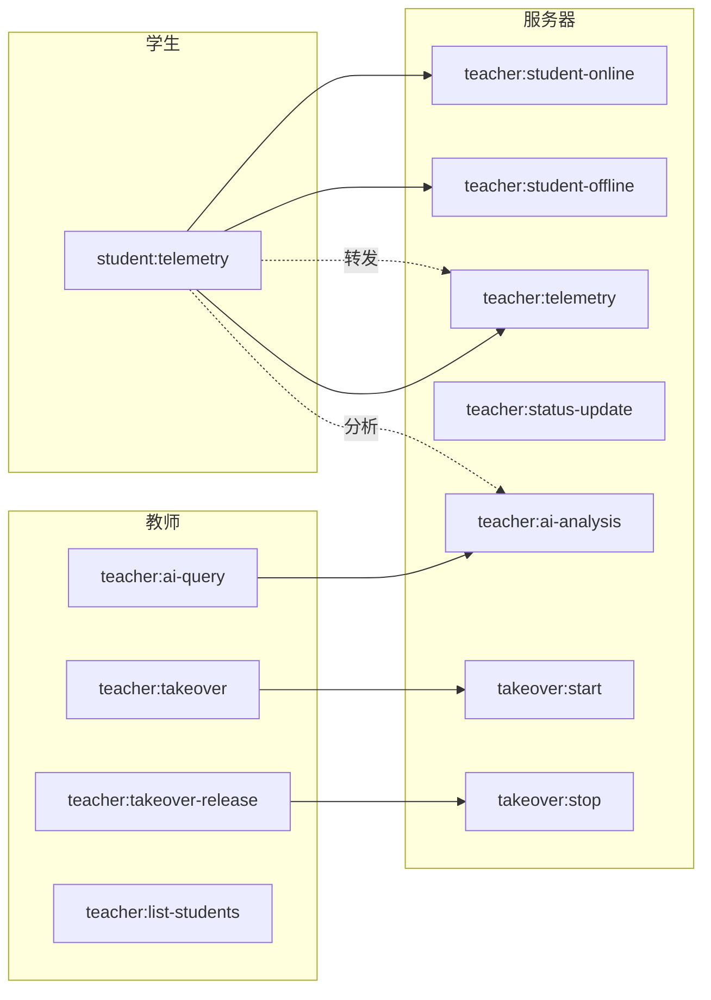
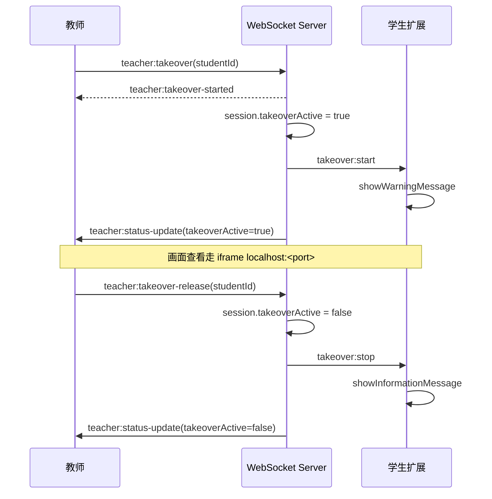
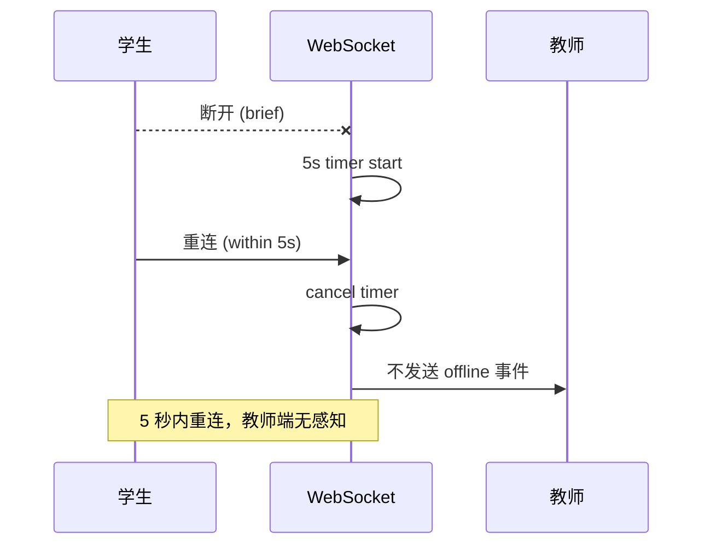

# WebSocket 事件

基于 Socket.IO，端口 3001。教师和学生通过 `query.role` 区分身份。

## 身份

```
教师:   io(url, { query: { role: "teacher" } })
学生:   io(url, { query: { role: "student", studentId, studentName } })
```

## 事件总览



## 学生 → 服务器

| 事件 | 触发 | 数据 |
|------|------|------|
| `student:telemetry` | 编辑器变更 / 空闲 | `{ type, timestamp, payload }` |

## 服务器 → 教师

| 事件 | 触发 | 数据 |
|------|------|------|
| `teacher:student-online` | 学生 WebSocket 连接 | `{ studentId, studentName }` |
| `teacher:student-offline` | 学生断线后 5 秒 | `{ studentId }` |
| `teacher:telemetry` | 转发学生遥测 | `{ studentId, data: { type, timestamp, payload } }` |
| `teacher:status-update` | 接管状态变化 | `{ studentId, takeoverActive: boolean }` |
| `teacher:ai-analysis` | AI 分析完成 | `{ studentId, analysis: { priority, progress, issues } }` |
| `teacher:error` | 操作失败 | `{ message }` |

## 教师 → 服务器

| 事件 | 说明 |
|------|------|
| `teacher:takeover` | 请求接管学生 `{ studentId }` |
| `teacher:takeover-release` | 释放接管 `{ studentId }` |
| `teacher:ai-query` | 请求 AI 分析 `{ studentId }` |
| `teacher:list-students` | 获取当前在线学生列表 |

## 服务器 → 学生

| 事件 | 说明 |
|------|------|
| `takeover:start` | 教师开始查看 |
| `takeover:stop` | 教师停止查看 |

## 教师接管时序



## 断线缓冲

学生 WebSocket 断开后，服务器不立即标记离线，等待 5 秒：

```
学生断线 → 5 秒计时 → 未重连 → 标记 offline
                      ↓
                 重连成功 → 取消计时
```

## 离线保护


