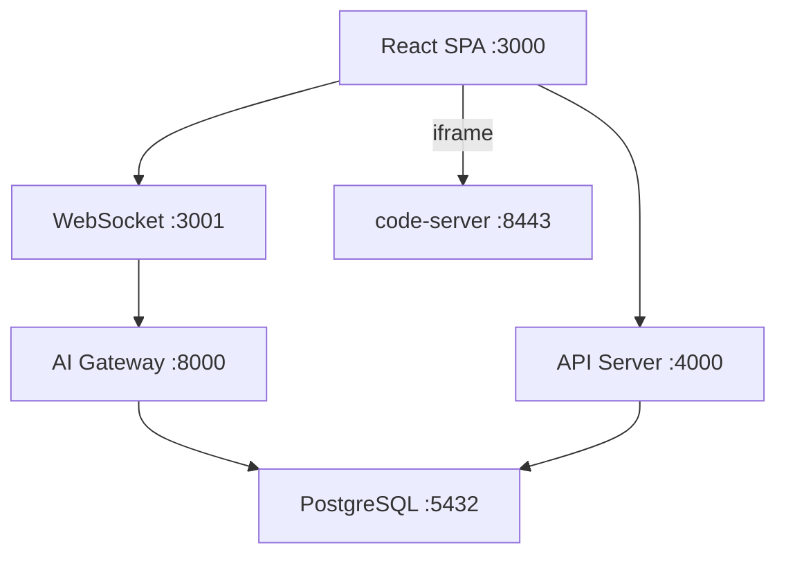

# SQLense 技术文档

## 概述

SQLense 是一个数据库实验课教学平台。学生身份认证 → 独立 IDE + 独立数据库 → 教师端实时监控 + AI 分析。

## 快速开始

```bash
docker compose up -d --build
```

| 入口 | 地址 | 说明 |
|------|------|------|
| 前端 | http://localhost:3000 | React SPA |
| API | http://localhost:4000/api/health | REST |
| Auth Proxy | http://localhost:8080 | code-server 认证代理（按学号路由） |
| Student IDE | http://localhost:8443 | 学生 code-server（单容器共享） |

默认账号: `admin` / `admin`（教师和学生在管理页面手工创建）

## 架构

```
7 个 Docker 容器
├── postgres           — 系统库 (sqlense) + 学生独立库 (db_student_N)
├── api-server         — Express REST API, httpOnly Cookie JWT 认证
├── websocket          — Socket.IO 实时事件总线
├── ai-gateway         — Python FastAPI, 多 Agent 智能分析
├── auth-proxy         — Nginx auth_request, code-server 认证网关
├── web               — Nginx + React SPA, 教师监控面板
└── code-server        — code-server, 单容器按学号隔离工作区
```



## 核心特性

### 学生隔离
- 每位学生拥有独立的 PostgreSQL 数据库 (`db_student_N`) 和数据库角色 (`role_student_N`)
- 单容器 code-server（通过 X-Student-Id header 隔离工作区），内置 SQLTools + psql
- 通过 auth-proxy 统一认证入口（auth_request 鉴权后按学号路由到 code-server）

### 实时监控
- 基于 VS Code Extension 的 Telemetry Tracker
- 学生 SQL 执行、编辑器状态、诊断错误、空闲状态实时上报
- 双缓冲策略: 单生高频 (2条/10s 触发分析) + 全局批量 (100条触发分析)

### AI 分析引擎
基于 Pydantic AI 的多 Agent 架构:

| Agent | 职能 |
|-------|------|
| Code Agent | 分析学生 SQL 代码质量，检测语法错误、模式问题 |
| SQL Agent | 关联终端输出与数据库状态，执行真实查询验证 |
| Judge | 综合诊断，生成优先级 (critical/high/medium/low) |
| Batch Agent | 批量过滤 100 条汇总数据，决定是否触发推送 |

### 教师面板
- 学生网格 (按优先级排序，状态指示器)
- AI 分析面板 (诊断摘要、进度跟踪)
- 远程协助 (iframe 接管 IDE)
- Toast 通知 (诊断摘要自动推送)

## 测试

测试覆盖三个层次:

### Layer 1: 全局 Batch 触发
测试全局批量分析流程: 100 条 telemetry 数据聚合 → Batch Agent 筛选 → 触发分析。

### Layer 2: 单生高频触发
测试单学生高频写入: 6 条终端事件在 10 秒内触发自动分析。

### Layer 3: 全量学生直接验证
覆盖 4 种场景各 30 名学生:
- `correct` (10人) — 已完成正确建表，预期 priority: `low`
- `missing_constraints` (8人) — 建表缺约束，预期 priority: `medium`/`high`
- `not_started` (7人) — 未建表，反复 SQL 报错，预期 priority: `high`/`critical`
- `off_track` (5人) — 错误语法/字段，预期 priority: `medium`/`high`

### 测试结果 (最近一次)

```
Layer 1 (全局 Batch): 分析=30  错误=0
Layer 2 (单生高频):   分析=30  错误=0
Layer 3 (全量直接):   30/30 通过  错误=0
总计: 分析=90  错误=0
结论: ✅ 全部通过
```

### 运行测试

```bash
# 需要 LLM_API_KEY 环境变量
cd tests/scenarios && bash run.sh
```

## 详细文档

| 文档 | 内容 |
|------|------|
| [SCRIPTS.md](SCRIPTS.md) | 脚本、命令、默认账号 |
| [DATABASE.md](DATABASE.md) | 数据库表结构、ER 图、外键 |
| [EXTENSION.md](EXTENSION.md) | VS Code 插件架构、钩子、配置 |
| [WEBSOCKET.md](WEBSOCKET.md) | WebSocket 事件、时序、断线保护 |
| [AI_GATEWAY.md](AI_GATEWAY.md) | 多 Agent 架构、数据模型、API |
| [DEPLOYMENT.md](DEPLOYMENT.md) | 生产部署、扩缩容、运维 |
| [TESTING.md](TESTING.md) | 测试方案、场景、用例 |
